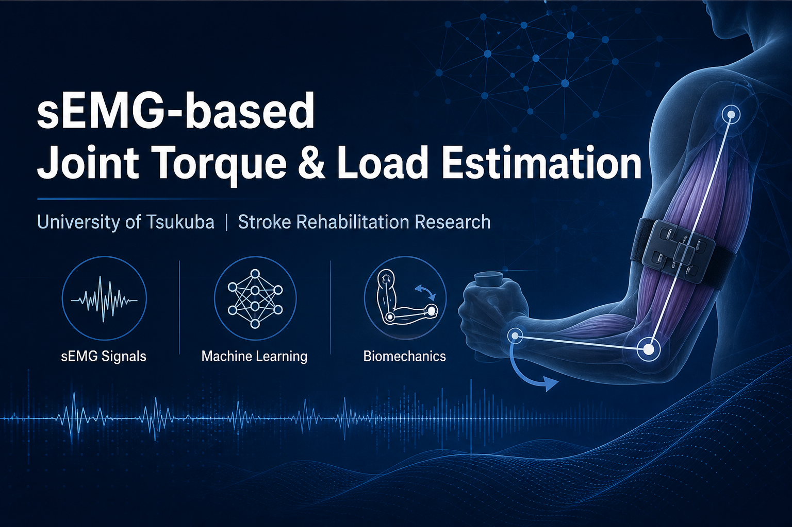
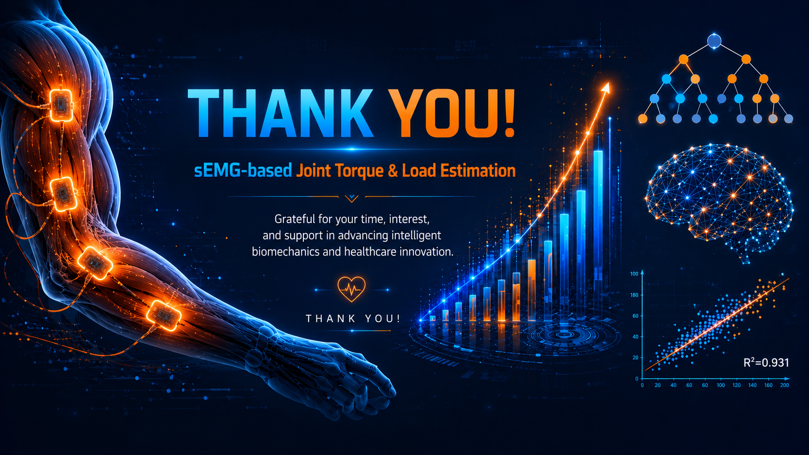

<div align="center">



<br><br>

[](https://python.org)
[](https://scikit-learn.org)
[](https://xgboost.readthedocs.io)
[](LICENSE)

**Estimating joint torque and external load from surface Electromyography (sEMG) signals using classical ML, deep learning, and unsupervised clustering.**

[Overview](#overview) · [Dataset](#dataset) · [Methodology](#methodology) · [Results](#results) · [Installation](#installation) · [Usage](#usage) · [Repository Structure](#repository-structure) · [Future Work](#future-work)

</div>

---

## Overview

This repository implements a complete **machine learning pipeline** for estimating **joint torque / external load** from **surface Electromyography (sEMG)** signals, with applications in stroke rehabilitation and SCI gait analysis.

The pipeline covers the full workflow:

| Stage | Description |
|-------|-------------|
| **Data Loading** | Automatic download of the open EMG Elbow Dataset from Zenodo |
| **Preprocessing** | Time-domain statistical feature extraction from 5 EMG channels |
| **EDA** | Waveform analysis, correlation heatmaps, PSD & spectrogram |
| **Supervised ML** | 5 classifiers for discrete load classification |
| **Unsupervised ML** | 5 clustering algorithms with ARI / Silhouette evaluation |
| **Deep Learning** | Multi-Layer Perceptron (MLP) for classification & regression |
| **Regression** | 5 regressors for continuous load estimation in grams |

> **Author:** Waqar Ali · **Date:** July 2026

---

## Dataset

We use the **[EMG Elbow Dataset](https://zenodo.org/record/7946782/files/EMG%20elbow%20dataset.zip)** hosted on Zenodo (Record `7946782`).

| Property | Value |
|----------|-------|
| **Subjects** | 10 healthy adults (6 male, 4 female) |
| **EMG Channels** | 5 per recording |
| **Sampling Rate** | 2000 Hz |
| **Load Conditions** | 0 g · 1360 g · 2270 g |
| **Exercises** | Flexion–Extension (`flex`) · Pronation–Supination (`pronsup`) |
| **Total Recordings** | 120 signal files (balanced across all conditions) |
| **File Format** | `{subj}_{exercise}_{set_type}_{load}.txt` |
| **Target Variable** | Load (grams) — proxy for joint torque / force |

The dataset is **automatically downloaded** when you run the analysis script or notebook — no manual setup required.

---

## Methodology

### 1. Feature Extraction

**40 time-domain statistical features** are computed per recording (8 features × 5 channels):

| Feature | Symbol | Description |
|---------|--------|-------------|
| Mean | `mean_i` | Average amplitude per channel |
| Std Dev | `std_i` | Signal variability |
| Max / Min | `max_i`, `min_i` | Signal extrema |
| RMS | `rms_i` | Root mean square amplitude |
| Peak-to-Peak | `p2p_i` | Max − Min amplitude |
| Energy | `energy_i` | Sum of squared samples |
| Zero-Crossing Rate | `zcr_i` | Frequency of sign changes |

Frequency-domain analysis (Welch PSD, spectrograms) is performed for EDA but not used as ML input features.

### 2. Preprocessing

- `StandardScaler` normalization on all features
- `LabelEncoder` for categorical variables (`exercise`, `set_type`, load classes)
- Train/test split: **75% / 25%**, stratified, `random_state=42`

### 3. Models Evaluated

#### Supervised Classification (5 Models)

| Model | Key Hyperparameters |
|-------|---------------------|
| Logistic Regression | `max_iter=1000` |
| K-Nearest Neighbors | `n_neighbors=5` |
| Support Vector Machine | `kernel='rbf'` |
| Random Forest | `n_estimators=150`, `max_depth=10` |
| XGBoost | `n_estimators=150`, `max_depth=6` |

#### Unsupervised Clustering (5 Models)

| Model | Configuration |
|-------|---------------|
| K-Means | `n_clusters=3` |
| Agglomerative Clustering | `n_clusters=3` |
| DBSCAN | `eps=1.5`, `min_samples=5` |
| Gaussian Mixture Model | `n_components=3` |
| Birch | `n_clusters=3` |

#### Regression (5 Models + MLP)

| Model | Key Hyperparameters |
|-------|---------------------|
| Linear Regression | — |
| Support Vector Regression | `kernel='rbf'` |
| Random Forest Regressor | `n_estimators=150`, `max_depth=10` |
| XGBoost Regressor | `n_estimators=150`, `max_depth=6` |
| MLP Regressor | `(128, 64, 32)`, ReLU, Adam, early stopping |

#### Deep Learning

| Model | Architecture | Task |
|-------|-------------|------|
| MLPClassifier | `(128, 64, 32)` | Load classification |
| MLPRegressor | `(128, 64, 32)` | Continuous load estimation |

---

## Results

### Best Model Performance

| Task | Best Model | Score |
|------|-----------|-------|
| **Classification** | Random Forest | **83.33% Accuracy** |
| **Regression** | XGBoost | **R² = 0.931** |
| **Regression (RMSE)** | XGBoost | **245.4 g** |
| **Deep Learning (Clf)** | MLP | 60.0% Accuracy |
| **Deep Learning (Reg)** | MLP | R² = 0.589 |
| **Unsupervised (ARI)** | Gaussian Mixture | 0.122 |

### Full Classification Results

| Model | Accuracy |
|-------|----------|
| Random Forest | **83.3%** |
| Logistic Regression | 80.0% |
| XGBoost | 80.0% |
| SVM (RBF) | 66.7% |
| KNN (k=5) | 63.3% |

### Full Regression Results

| Model | R² | RMSE (g) |
|-------|-----|----------|
| XGBoost | **0.931** | **245.4** |
| Random Forest | 0.922 | 262.1 |
| Linear Regression | 0.879 | 325.2 |
| MLP Regressor | 0.589 | 599.8 |
| SVR (RBF) | −0.051 | 959.5 |

### Key Findings

- **Strong load–amplitude correlation:** Pearson *r* = **0.886** between `mean_4` and applied load
- **Spectral shift with load:** Mean frequency increases from ~7 Hz (0 g) to ~43 Hz (2270 g), indicating higher motor unit recruitment
- **Subject variability:** Significant inter-subject differences — normalization recommended for cross-subject generalization
- **Supervised > Unsupervised:** Clustering ARI < 0.3 confirms load classes are not naturally separable without labels
- **Tree-based models win:** Random Forest and XGBoost outperform neural networks on this small, structured dataset

### Generated Figures

The notebook produces 9 publication-quality figures (600 DPI), saved in the [`results/`](results/) directory:

| Figure | Description |
|--------|-------------|
| [`data_distribution.jpg`](results/data_distribution.jpg) | Load & exercise distribution |
| [`eda_signal_waveforms.jpg`](results/eda_signal_waveforms.jpg) | Time-domain EMG waveforms |
| [`eda_correlation.jpg`](results/eda_correlation.jpg) | Feature–load correlation heatmap |
| [`eda_frequency_analysis.jpg`](results/eda_frequency_analysis.jpg) | PSD & spectrogram analysis |
| [`eda_mean_freq_boxplot.jpg`](results/eda_mean_freq_boxplot.jpg) | Mean frequency vs. load |
| [`supervised_5models.jpg`](results/supervised_5models.jpg) | Confusion matrices & accuracy bar chart |
| [`unsupervised_5models.jpg`](results/unsupervised_5models.jpg) | PCA scatter & ARI comparison |
| [`deeplearning_regression.jpg`](results/deeplearning_regression.jpg) | MLP & regression results |
| [`final_summary.jpg`](results/final_summary.jpg) | Complete results dashboard |

---

## Installation

### Prerequisites

- Python 3.8 or higher
- pip package manager

### Setup

```bash
# Clone the repository
git clone https://github.com/waqi786/sEMG_Load_Estimation.git
cd sEMG_Load_Estimation

# Create a virtual environment (recommended)
python -m venv venv
source venv/bin/activate        # Linux / macOS
# venv\Scripts\activate         # Windows

# Install dependencies
pip install -r requirements.txt
```

---

## Repository Structure

```
sEMG_Load_Estimation/
├── data/                       # Downloaded dataset (auto‑generated)
├── notebooks/                  # Jupyter notebook with full analysis
├── src/                        # Source code (if any)
├── results/                    # Generated figures (9 images)
├── assets/                     # Banner and thank-you image
├── requirements.txt            # Python dependencies
├── LICENSE                     # MIT License
└── README.md                   # This file
```

---

## Future Work

- **CNN / LSTM architectures** on raw time‑series to avoid manual feature engineering.
- **Transfer learning** across subjects to improve generalisation.
- **Real‑time deployment** on edge devices for wearable rehabilitation systems.
- **Multi‑task learning** to jointly predict load and exercise type.

---

## Thank You

<div align="center">
  
</div>
```
